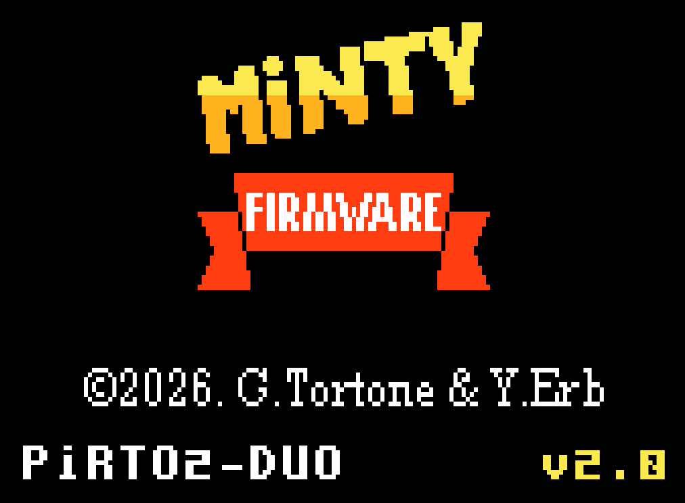
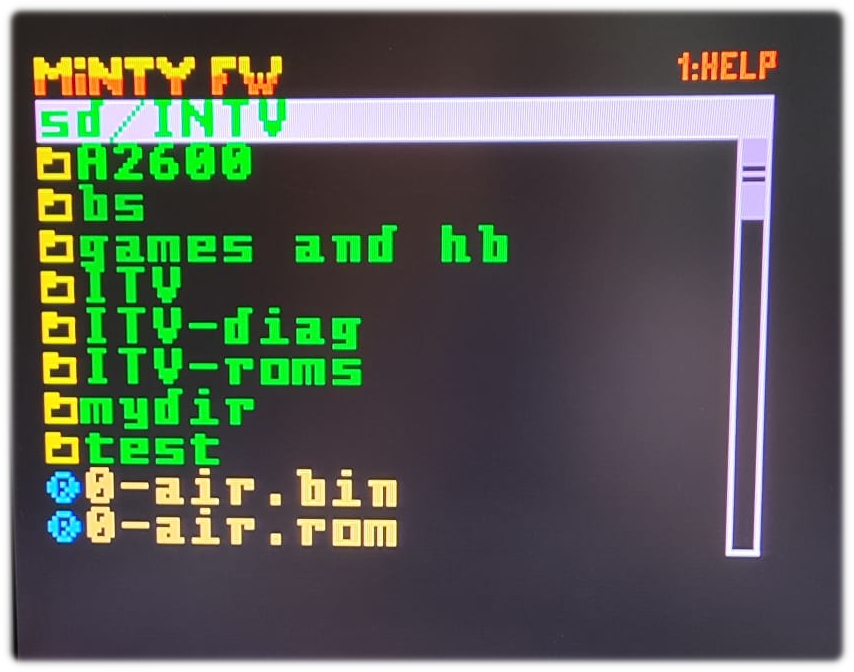
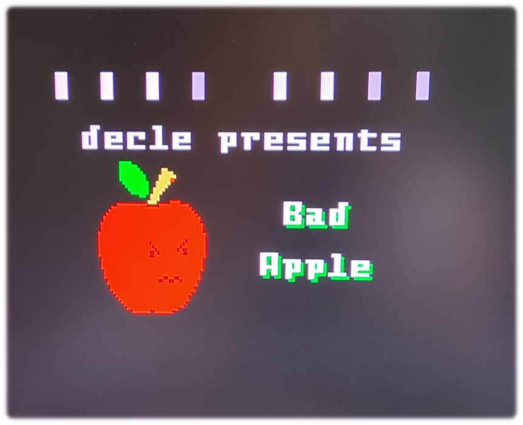
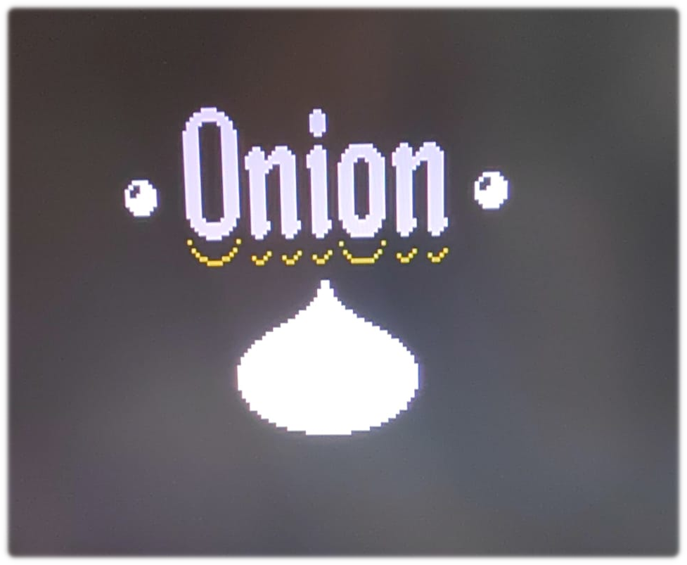
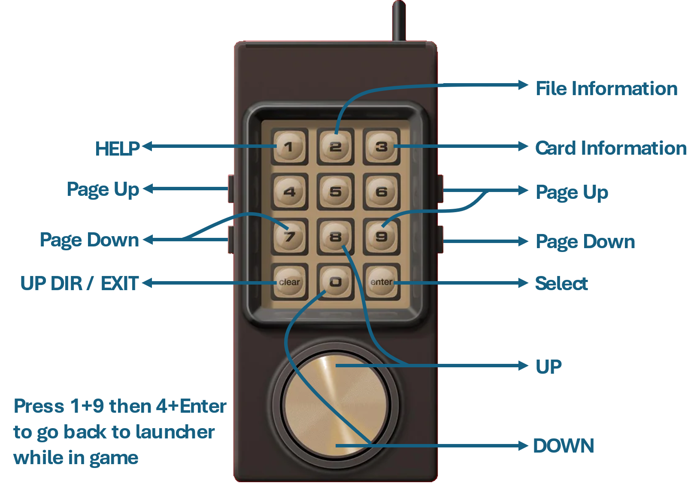

# Minty
MultiCart for Mattel Intellivision

## Introduction

Multi-cart based on Raspberry Pi Pico hardware and PiRTOII firmware (https://github.com/aotta/PiRTOII)

## Features

- Pico C/C++ code refactoring
- Intybasic code refactoring
- support for RP2040 multicarts: Pirto, Pirto-II, Pirto-II-SD
- support for RP2350 multicart Pirto-II-Duo
- no more config files for "official" ITV titles
- new navigation keys for launcher
- new color schema for launcher
- support for long filenames (up to 255 chars)
- move from 64 to 512 max number of files for directory
- SD support (with sukkopera board: https://github.com/SukkoPera/PiRTOII)
- Intellicart ROM support (.rom)
- new data structure for page decoding with O(1) lookup performance
- VFS (Virtual File System) library included to access storage devices based on FatFs or LittleFs
- full JLP support: hardware acceleration, expanded memory and save/load on flash
- new launcher firmware with icons and custom fonts with automatic saving of last opened directory 
- tons of roms tested - Minty is now able to run [Bad Apple demo](https://forums.atariage.com/topic/266031-intellivision-bad-apple/) (445 kB ROM with 52 memory pages) on RP235x boards

## Screenshots

|  |  |
|------------------------------|------------------------------|
|  |  |


## Table of features

| board  | MCU | RAM | max ROM size  | JLP | ROM storage | build target |
|--------|-----|-----|---------------| --- | ----------- | ------------ |
| [Pirto](https://github.com/aotta/PiRTO) | RP2040 | 256 kB | ~180kB      | ❌  | microSD     | `pirto` |
| [Pirto-II](https://github.com/aotta/PiRTOII) | RP2040 | 256 kB | ~100kB   | ❌  | flash       | `pirto_ii_default` |
| [Pirto-II-SD](https://github.com/SukkoPera/PiRTOII) | RP2040 | 256 kB | ~180kB | ❌ | microSD     | `pirto_ii_sd` |
| [Pirto-II-Duo](https://github.com/aotta/PiRTOIIDuo) | RP2350 | 512 kB | ~450 kB | ✅ | microSD   | `pirto_ii_duo` |
| [PintyCard](https://oshwlab.com/yannick.erb/intv-pirto-hb) | RP2354A | 512 kB | ~450kB | ✅ | flash | `pintycard` |

## Firmware

Firmware files for different boards (.bin and .uf2) are available in [release](https://github.com/gtortone/Minty/releases) section.

## Getting started

To simply program Pi Pico:
- connect it to your PC/laptop using an USB-C cable while pressing Pico on-board button (boot MODE)
- drag and drop .uf2 file inside root directory

Setup ROMs:
- copy your ITV ROM to flash (or microSD) root directory
- if ROM name is included in [cfg/0game-maps.csv](cfg/0game-maps.csv) you do not need to add config (.cfg) file
- enjoy your PiRTOII cart with Minty firmware !

## User interface

### Controller keys

<div align="center">
   
</div>

## Build (TL;DR)

### Requirements

- Pico-SDK (https://github.com/raspberrypi/pico-sdk)
- CMake (>3.13)

### Commands

Replace `BOARD` with build target available on table of features.

```
cmake -B build/BOARD/debug -DPICO_BOARD=BOARD -DCMAKE_BUILD_TYPE=Debug
make -j -C build/pirto_ii_duo/debug
   or
cmake -B build/BOARD/release -DPICO_BOARD=BOARD -DCMAKE_BUILD_TYPE=Release
make -j -C build/pirto_ii_duo/release
```

After compilation `Minty.bin` and `Minty.uf2` are generated.

To use `Minty.bin` to flash a board `picotool` is required. Run following
command after setting Pi Pico in BOOT mode:

```
picotool load -f Minty.bin; picotool reboot
```

## Credits

Thanks a lot to Andrea Ottaviani for his PiRTOII firmware (https://github.com/aotta/PiRTOII) and PCB files.

Thanks a lot to sukkopera for his PirtoII board with microSD card slot (https://github.com/SukkoPera/PiRTOII)

A special thanks to Minty new developer Yannick Erb for his priceless contribution on launcher and various patches and improvements on the firmware.


