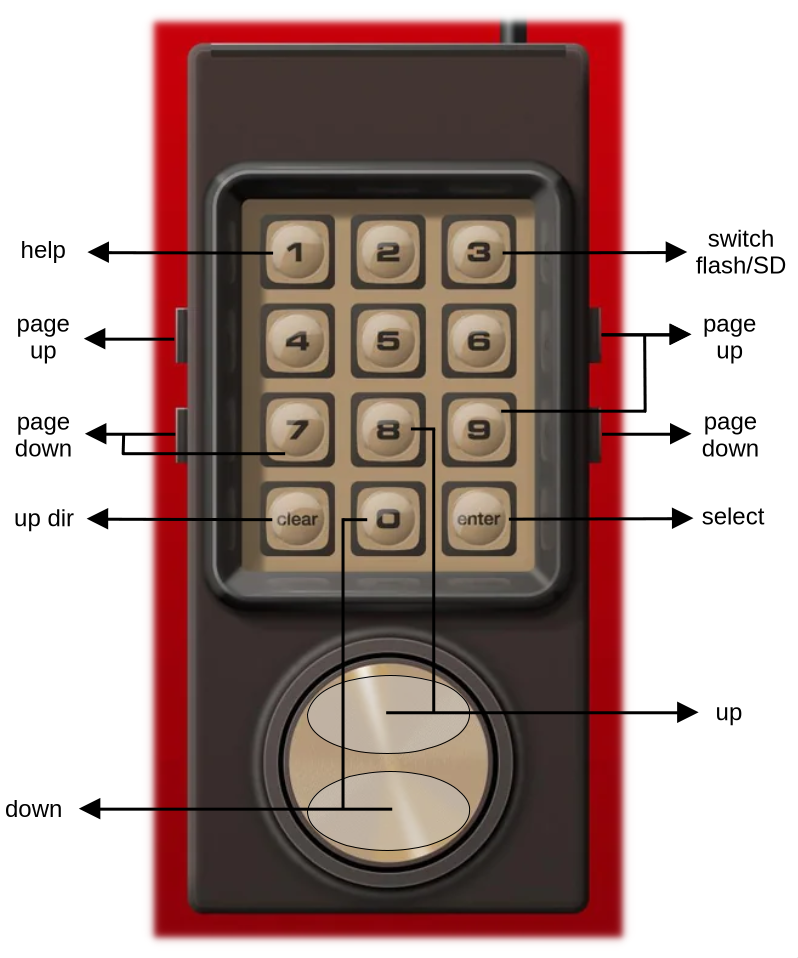

# Minty
MultiCart for Mattel Intellivision

## Introduction

Multi-cart based on Raspberry Pi Pico hardware and PiRTOII firmware (https://github.com/aotta/PiRTOII)

## Features

- Pico C/C++ code refactoring
- Intybasic code refactoring
- no more config files for "official" ITV titles
- new navigation keys for UI ROM
- new color schema for UI ROM

## Getting started

To simply program Pi Pico:
- connect it to your PC/laptop using an USB-C cable while pressing Pico on-board button (boot MODE)
- drag and drop `Minty.uf2` inside root directory

Setup ROMs:
- copy your ITV ROM to root directory (rename ROM file names to 8 character + .bin extension)
- if ROM name is included in  you do not need to add config (.cfg) file
- enjoy your PiRTOII cart with Minty firmware !

## User interface

<div align="center">
   
</div>

## Build (TL;DR)

### Requirements

- Pico-SDK (https://github.com/raspberrypi/pico-sdk)
- CMake (>3.13)

### Commands

```
mkdir build
cd build
cmake ..
make
```

After compilation `Minty.bin` and `Minty.uf2` are generated.

To use `Minty.bin` to flash PiRTOII cart `picotool` is required. Run following
command after setting Pi Pico in BOOT mode:

```
picotool load -f Minty.bin; picotool reboot
```

## Credits

Thanks a lot to Andrea Ottaviani for his PiRTOII firmware (https://github.com/aotta/PiRTOII)
and PCB files.


