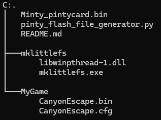
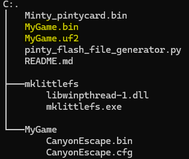

# PiNTY flash file creation tool

This tutorial shows how to generate a .uf2 file and how to write it to a PiNTY card.

##  Required files

- The PiNTY Flash file generator : https://github.com/gtortone/Minty/blob/main/contrib/pinty_flash_file_generator.py
- A python 3 install with tkinter
- mklittlefs : https://github.com/earlephilhower/mklittlefs/releases

##  Prepare files

- Put the game file(s) in a separate directory 
- The game can be either a ROM file or a BIN and corresponding CFG file
- Compile the latest Minty firware for PiNTY Card in binary (.bin) format

    I am putting all in the same directory that is looking like this :

    

## Generate file

- Start a cmd or power shell in the directory where you put the PiNTY Flash generator
- Launch the generator with "python .\pinty_flash_file_generator.py"
- Fill in UI as shown here :

- Click on "Build All" button to generate the .bin and .uf2 file that can be used to flash the PintyCard
- In my case I will have the files MyGame.bin and MyGame.uf2 created :

    

## Flashing file on PiNTY

- Mount the PiNTYCARD on the programming interface and lock it into place

   

- Connect the programmer to computer while pressing the button on programmer (the little thing behind the huge finger!)

   
   
- A window will open, drag the .uf2 file generated in previous step to the window and wait till the window closes

   
   
- The card is now ready to be used

